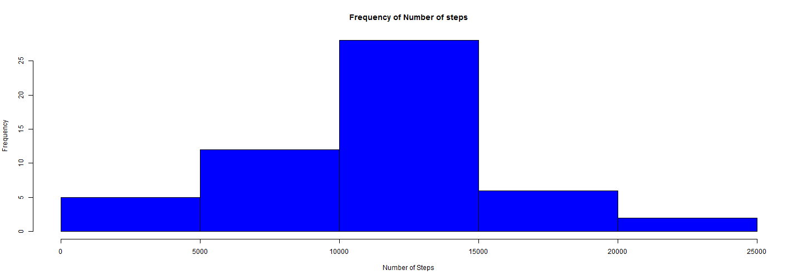
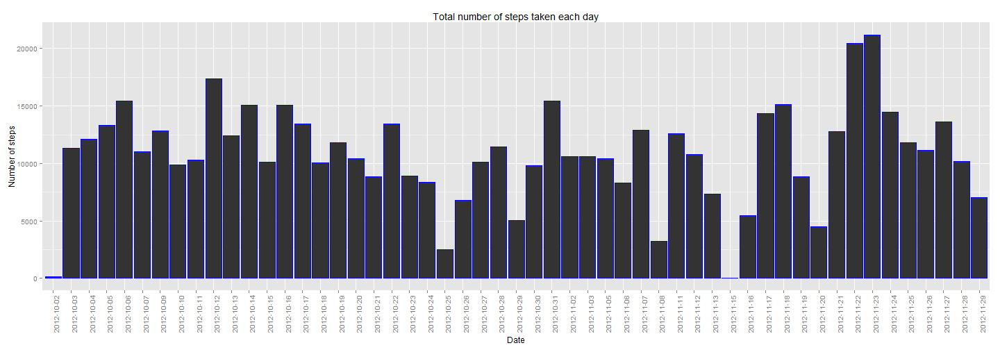
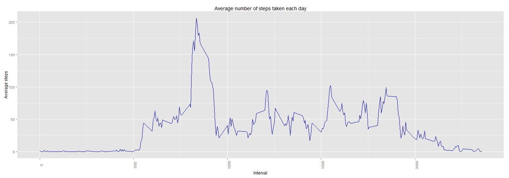
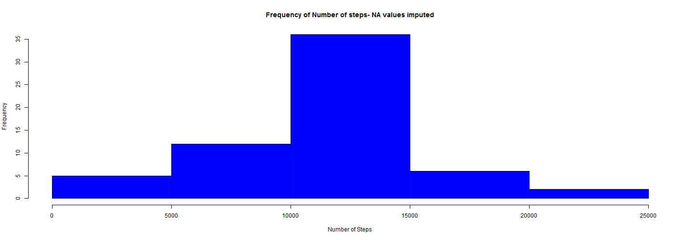
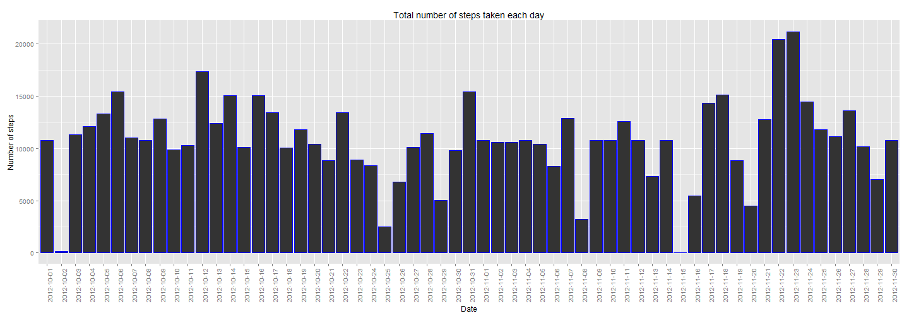
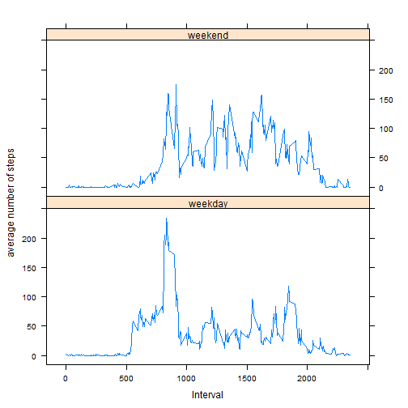

**Introduction**

It is now possible to collect a large amount of data about personal movement using activity monitoring
devices such as a Fitbit (http://www.fitbit.com), Nike Fuelband (http://www.nike.com/us/en_us/c/nikeplusfuelband),
or Jawbone Up (https://jawbone.com/up). These type of devices are part of the "quantified self"
movement - a group of enthusiasts who take measurements about themselves regularly to improve their
health, to find patterns in their behavior, or because they are tech geeks. But these data remain underutilized
both because the raw data are hard to obtain and there is a lack of statistical methods and
software for processing and interpreting the data.
This assignment makes use of data from a personal activity monitoring device. This device collects data
at 5 minute intervals through out the day. The data consists of two months of data from an anonymous
individual collected during the months of October and November, 2012 and include the number of steps
taken in 5 minute intervals each day.

**Show any code that is needed to**
- Load the data (i.e. read.csv() )
- Process/transform the data (if necessary) into a format suitable for your analysis


```r
## load the ggplot library
library(ggplot2)
## Reading the data file
data<-read.csv("activity.csv")
## Ignore missing values
data<-subset(data,!is.na(data$steps))
```
**What is mean total number of steps taken per day?**

For this part of the assignment, you can ignore the missing values in the dataset.

- *1 . Make a histogram of the total number of steps taken each day*

```r
result<-aggregate(data$steps, by=list(data$date), FUN=sum)
colnames(result)<-c("date","total_steps")
### histogram for all the steps 
hist(result$total_steps,xlab="Number of Steps",main="Frequency of Number of steps",col="blue")
```

 

```r
## bar chart to show total steps each day
out<- ggplot(result, aes(date, total_steps))+geom_bar(stat = "identity", colour = "blue")
out<-out+xlab("Date")+ylab("Number of steps") + theme(axis.text.x = element_text(angle = 90))
out+ggtitle("Total number of steps taken each day")
```

 

- *2. Calculate and report the mean and median total number of steps taken per day*

```r
assign1_mean<-mean(result$total_steps)
cat("The mean total number of steps taken per day : ",assign1_mean)
```

```
## The mean total number of steps taken per day :  10766.19
```

```r
assign1_median<-median(result$total_steps)
cat("The median total number of steps taken per day : ",assign1_median)
```

```
## The median total number of steps taken per day :  10765
```

**What is the average daily activity pattern?**

- *1. Make a time series plot (i.e. type = "l" ) of the 5minute interval (xaxis) and the average number of steps taken, averaged across all days (yaxis)*

```r
## Reading the data file
data<-read.csv("activity.csv")
## Ignore missing values
data<-subset(data,!is.na(data$steps))
## find average number of steps taken at each interval
result<-aggregate(data$steps, by=list(data$interval), FUN=mean)
colnames(result)<-c("interval","mean_steps")
out<- ggplot(result, aes(interval, mean_steps)) + geom_line(color = "blue") 
out<-out+xlab("Interval")+ylab("Average steps") + theme(axis.text.x = element_text(angle = 90))
out+ggtitle("Average number of steps taken each day")
```

 
- *Which 5minute interval, on average across all the days in the dataset, contains the max number of steps?*


```r
subset(result,result$mean_steps == max(result$mean_steps))
```

```
##     interval mean_steps
## 104      835   206.1698
```

**Imputing missing values**

-*1. Calculate and report the total number of missing values in the dataset (total number of rows with NAs)*


```r
data<-read.csv("activity.csv")
cat("Total number of missing values in data set :",nrow(subset(data,is.na(data$steps))))
```

```
## Total number of missing values in data set : 2304
```

-*2. Devise a strategy for filling in all of the missing values in the dataset.*

I use the mean for an interval of all the days to fill NA values.for example interval "5" has 3 values as 40,20,30 on three different days, mean will be 30.

-*3. Create a new dataset that is equal to the original dataset but with the missing data filled in.*

```r
## read the data file 
data<-read.csv("activity.csv")
## remove NA values
data<-subset(data,!is.na(data$steps))
## calculate mean of each interval for all days
result<-aggregate(data$steps, by=list(data$interval), FUN=mean)
## update column name of result data set
colnames(result)<-c("interval","mean_steps")
## read data set again to have NA values in data
data<-read.csv("activity.csv")
## loop and iterate through each record in data set
for (index_count in 1: nrow(data)) 
  {
	if (is.na(data$steps[index_count])) 
		{
    ## assign mean of steps at interval where NA is in steps
    data$steps[index_count] <-subset(result,data$interval[index_count]  ==  result$interval)$mean_steps
		}
	}
```

- *4.Make a histogram of the total number of steps taken each day*


```r
result<-aggregate(data$steps, by=list(data$date), FUN=sum)
colnames(result)<-c("date","total_steps")
### histogram for all the steps 
hist(result$total_steps,xlab="Number of Steps",main="Frequency of Number of steps- NA values imputed",col="blue")
```

 

```r
## datewise chart for total
out<-ggplot(result, aes(date, total_steps))+geom_bar(stat = "identity", colour = "blue")
out<-out+xlab("Date")+ylab("Number of steps") + theme(axis.text.x = element_text(angle = 90))
out+ggtitle("Total number of steps taken each day")
```

 


-*4. Calculate and report the mean and median total number of steps taken per day*

```r
cat("New - The mean total number of steps taken per day : ",mean(result$total_steps))
```

```
## New - The mean total number of steps taken per day :  10766.19
```

```r
cat("New - The median total number of steps taken per day : ",median(result$total_steps))
```

```
## New - The median total number of steps taken per day :  10766.19
```

```r
cat("Old - The mean total number of steps taken per day : ",assign1_mean)
```

```
## Old - The mean total number of steps taken per day :  10766.19
```

```r
cat("Old - The median total number of steps taken per day : ",assign1_median)
```

```
## Old - The median total number of steps taken per day :  10765
```
-*4. Do these values differ from the estimates from the first part of the assignment?*

The mean value does not differ however median value has been changed due to imputing.
the new median of total steps taken per day is greater than that of the old median.

**Are there differences in activity patterns between weekdays and weekends?**
- *1. Create a new factor variable in the dataset with two levels - "weekday" and "weekend" indicating whether a given date is a weekday or weekend day.*

```r
data<-read.csv("activity.csv")
data<-subset(data,!is.na(data$steps))
for (index_count in 1: nrow(data)) 
  {
  ## check if the day is a weekend or weekday
  if (weekdays(as.Date(as.character(data$date[index_count]))) %in% c("Saturday", "Sunday")) 
    {
    ## update the value as weekend
    data$weekdays[index_count] <-c("weekend")
    }
  else
		{
    ## update the value as weekday
    data$weekdays[index_count] <-c("weekday")
		}
	}
```

- *2. Make a panel plot containing a time series plot (i.e. type = "l" ) of the 5minute interval (xaxis) and the average number of steps taken, averaged across all weekday days or weekend days (yaxis)*

```r
## 
result <-aggregate(data$steps,list(interval = as.numeric(as.character(data$interval)),weekdays = data$weekdays),FUN = mean)
colnames(result)<-c("interval","weekdays","mean_steps")
library(lattice)
xyplot(result$mean_steps ~ result$interval|result$weekdays,layout = c(1, 2), type = "l",xlab="Interval",ylab="average number of steps")
```

 
